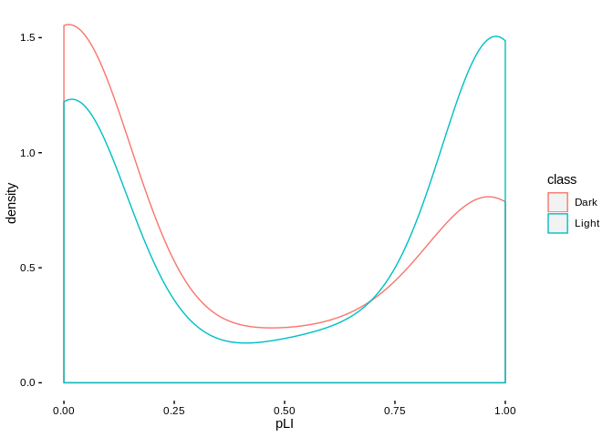
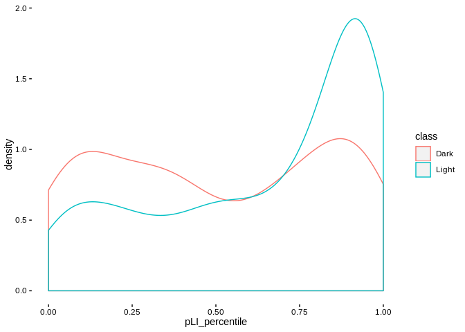

ExAC Kinase Data
================
Matthew Berginski

Download/Load Data
==================

``` r
ExAC_file = here('Exac/forweb_cleaned_exac_r03_march16_z_data_pLI.txt.gz')
if (! file.exists(ExAC_file)) {
  download.file("ftp://ftp.broadinstitute.org/pub/ExAC_release/current/manuscript_data/forweb_cleaned_exac_r03_march16_z_data_pLI.txt.gz",
                ExAC_file)
}

ExAC_data = read.delim(ExAC_file);
ExAC_data = ExAC_data %>%
  mutate(pLI_percentile = cume_dist(pLI))
```

Kinase Filtering/Plotting
=========================

``` r
ExAC_kinases = ExAC_data %>% 
  filter(gene %in% all_kinases$symbol) %>%
  left_join(all_kinases, by=c('gene'='symbol'))
```

    ## Warning: Column `gene`/`symbol` joining factors with different levels,
    ## coercing to character vector

``` r
ggplot(ExAC_kinases, aes(x=pLI, color=class)) + 
  geom_density() + theme_berginski()
```



``` r
ggplot(ExAC_kinases, aes(x=pLI_percentile, color=class)) + 
  geom_density() + theme_berginski()
```



Dark Kinase pLi Values
======================

``` r
top_ExAC_DK = ExAC_kinases %>% 
  filter(class == "Dark") %>%
  arrange(desc(pLI)) %>%
  select(gene,pLI,pLI_percentile) %>%
  top_n(20)
```

    ## Selecting by pLI_percentile

``` r
kableExtra::kable(top_ExAC_DK)
```

<table>
<thead>
<tr>
<th style="text-align:left;">
gene
</th>
<th style="text-align:right;">
pLI
</th>
<th style="text-align:right;">
pLI\_percentile
</th>
</tr>
</thead>
<tbody>
<tr>
<td style="text-align:left;">
CDC42BPB
</td>
<td style="text-align:right;">
1.0000000
</td>
<td style="text-align:right;">
0.9954458
</td>
</tr>
<tr>
<td style="text-align:left;">
TLK2
</td>
<td style="text-align:right;">
0.9999998
</td>
<td style="text-align:right;">
0.9880933
</td>
</tr>
<tr>
<td style="text-align:left;">
TAOK1
</td>
<td style="text-align:right;">
0.9999997
</td>
<td style="text-align:right;">
0.9873800
</td>
</tr>
<tr>
<td style="text-align:left;">
PRPF4B
</td>
<td style="text-align:right;">
0.9999997
</td>
<td style="text-align:right;">
0.9872154
</td>
</tr>
<tr>
<td style="text-align:left;">
WNK3
</td>
<td style="text-align:right;">
0.9999984
</td>
<td style="text-align:right;">
0.9815638
</td>
</tr>
<tr>
<td style="text-align:left;">
TLK1
</td>
<td style="text-align:right;">
0.9999948
</td>
<td style="text-align:right;">
0.9779424
</td>
</tr>
<tr>
<td style="text-align:left;">
CDK12
</td>
<td style="text-align:right;">
0.9999918
</td>
<td style="text-align:right;">
0.9759671
</td>
</tr>
<tr>
<td style="text-align:left;">
PAN3
</td>
<td style="text-align:right;">
0.9999897
</td>
<td style="text-align:right;">
0.9748697
</td>
</tr>
<tr>
<td style="text-align:left;">
HIPK1
</td>
<td style="text-align:right;">
0.9999429
</td>
<td style="text-align:right;">
0.9669684
</td>
</tr>
<tr>
<td style="text-align:left;">
MARK4
</td>
<td style="text-align:right;">
0.9999321
</td>
<td style="text-align:right;">
0.9659808
</td>
</tr>
<tr>
<td style="text-align:left;">
CDC42BPA
</td>
<td style="text-align:right;">
0.9999201
</td>
<td style="text-align:right;">
0.9643896
</td>
</tr>
<tr>
<td style="text-align:left;">
CSNK1G1
</td>
<td style="text-align:right;">
0.9997154
</td>
<td style="text-align:right;">
0.9545130
</td>
</tr>
<tr>
<td style="text-align:left;">
CSNK2A2
</td>
<td style="text-align:right;">
0.9991542
</td>
<td style="text-align:right;">
0.9434842
</td>
</tr>
<tr>
<td style="text-align:left;">
TESK1
</td>
<td style="text-align:right;">
0.9990035
</td>
<td style="text-align:right;">
0.9416187
</td>
</tr>
<tr>
<td style="text-align:left;">
MAST3
</td>
<td style="text-align:right;">
0.9989253
</td>
<td style="text-align:right;">
0.9405761
</td>
</tr>
<tr>
<td style="text-align:left;">
TAOK2
</td>
<td style="text-align:right;">
0.9987645
</td>
<td style="text-align:right;">
0.9387106
</td>
</tr>
<tr>
<td style="text-align:left;">
CDK19
</td>
<td style="text-align:right;">
0.9980171
</td>
<td style="text-align:right;">
0.9312483
</td>
</tr>
<tr>
<td style="text-align:left;">
CDKL5
</td>
<td style="text-align:right;">
0.9977901
</td>
<td style="text-align:right;">
0.9294925
</td>
</tr>
<tr>
<td style="text-align:left;">
TTBK1
</td>
<td style="text-align:right;">
0.9973070
</td>
<td style="text-align:right;">
0.9270782
</td>
</tr>
<tr>
<td style="text-align:left;">
TTBK2
</td>
<td style="text-align:right;">
0.9969294
</td>
<td style="text-align:right;">
0.9247737
</td>
</tr>
</tbody>
</table>
