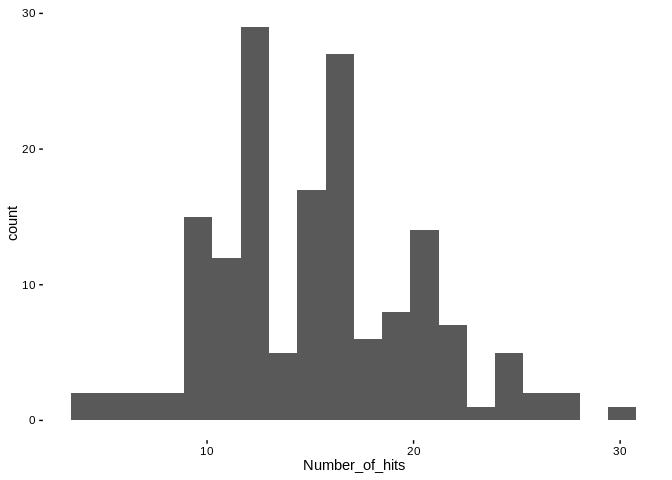
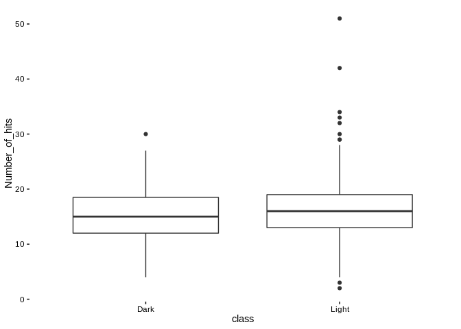
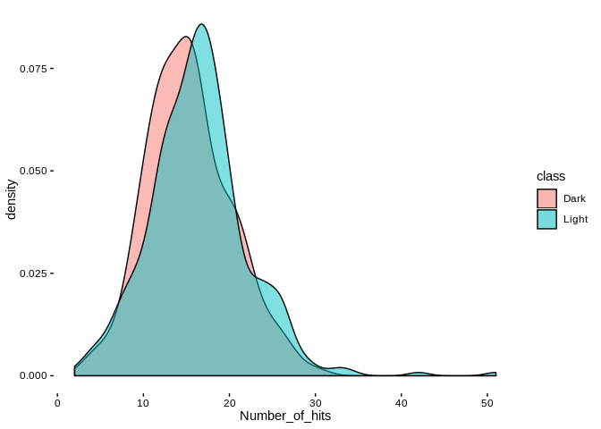

GenomeRNAi Processing
================
Matthew Berginski

Data Source
===========

There is a database of RNAi screens named GenomeRNAi that I'm looking to scan for the dark kinases (genomernai.org). The primary download links are broken, but I manually copied out their master list of gene hits and saved it out using calc (saved as GenomeRNAi.ods). After getting the data into the spreadsheet I added column headers and saved as csv (GenomeRNAi.csv). I should try to contact them to get a complete list, maybe...

Read in Data and Scan for Kinases
=================================

``` r
RNAi = read.csv(here('GenomeRNAi/GenomeRNAi.csv'))
kinase_RNAi = RNAi %>% 
  filter(Entrez_Gene_ID %in% all_kinases$entrez_id) %>%
  left_join(all_kinases, by=c('Entrez_Gene_ID'='entrez_id'))

dark_RNAi = kinase_RNAi %>% filter(class=="Dark")
light_RNAi = kinase_RNAi %>% filter(class=="Light")
```

OK then, there's quite a few hits (159). Let's take a look at the distribution of number of hits.

``` r
ggplot(dark_RNAi,aes(x=Number_of_hits)) + geom_histogram(bins=20) + theme_berginski()
```



The top ten dark kinases along with the number of hits are as follows:

``` r
kable(dark_RNAi %>% 
        arrange(desc(Number_of_hits)) %>% 
        slice(1:10) %>%
        select(Gene,Number_of_hits))
```

<table>
<thead>
<tr>
<th style="text-align:left;">
Gene
</th>
<th style="text-align:right;">
Number\_of\_hits
</th>
</tr>
</thead>
<tbody>
<tr>
<td style="text-align:left;">
RIOK1
</td>
<td style="text-align:right;">
30
</td>
</tr>
<tr>
<td style="text-align:left;">
PI4KA
</td>
<td style="text-align:right;">
27
</td>
</tr>
<tr>
<td style="text-align:left;">
CDKL5
</td>
<td style="text-align:right;">
27
</td>
</tr>
<tr>
<td style="text-align:left;">
PKN3
</td>
<td style="text-align:right;">
26
</td>
</tr>
<tr>
<td style="text-align:left;">
BCKDK
</td>
<td style="text-align:right;">
26
</td>
</tr>
<tr>
<td style="text-align:left;">
SCYL3
</td>
<td style="text-align:right;">
25
</td>
</tr>
<tr>
<td style="text-align:left;">
NEK8
</td>
<td style="text-align:right;">
25
</td>
</tr>
<tr>
<td style="text-align:left;">
PRPF4B
</td>
<td style="text-align:right;">
24
</td>
</tr>
<tr>
<td style="text-align:left;">
CDK13
</td>
<td style="text-align:right;">
24
</td>
</tr>
<tr>
<td style="text-align:left;">
PRKCQ
</td>
<td style="text-align:right;">
24
</td>
</tr>
</tbody>
</table>
Comparison to Light Kinases
===========================

``` r
ggplot(kinase_RNAi,aes(x=class, y=Number_of_hits)) + geom_boxplot() + theme_berginski()
```



``` r
ggplot(kinase_RNAi,aes(x=Number_of_hits, fill=class)) + geom_density(alpha=0.5) + theme_berginski()
```



That's pretty interesting, the light (412 gene represented) kinases have nearly the same distribution as the dark kinases. The mean number of hits is slightly higher (15.3144654 dark, 16.4247573 light), but the distributions are quite similar.
